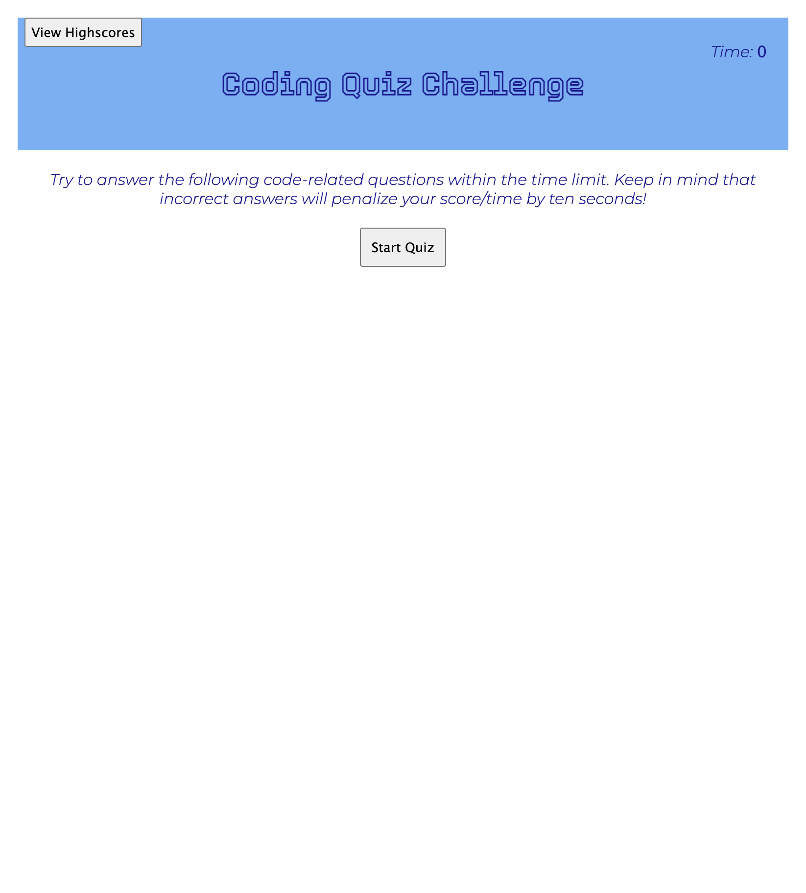
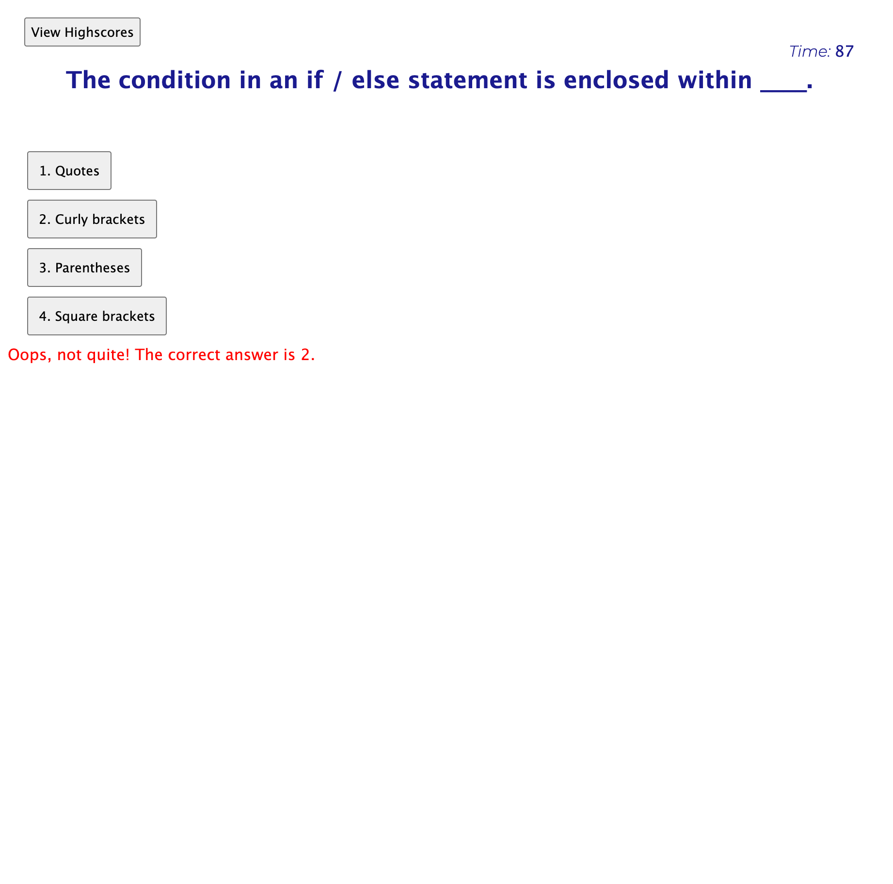
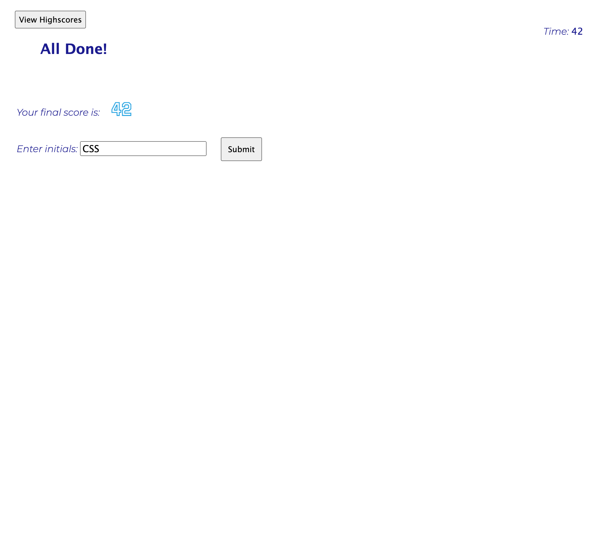
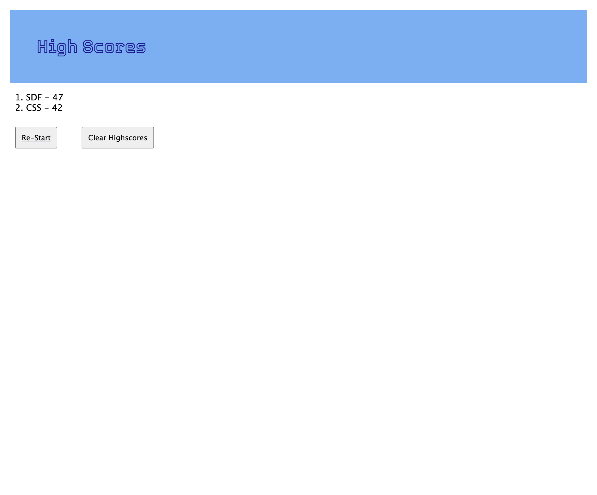

# web-developer-quiz
A quiz testing web development knowledge.

## Description

This site is a full-stack web development assessment that simulates the type of multiple-choice assessment that would be administered by an employer as a part of the application process to obtain a job in web development. A user clicks through the interactive coding quiz, then enters their initials to save their high score before resetting and starting over. This site assists users familiarize themselves with these kind of tests and offers them feedback so that they can track their progress (highscores) and learn from incorrect answers.

Web API concepts like event listeners, timer intervals, window objects, and local storage objects, were applied to this project as well as flexbox, media queries, and CSS variables as some of the other main components that were applied to this project for its success.

## Installation

N/A

## Usage

The assessment will commence with a landing page that presents the user instructions and a "Start Quiz" button. To initiate the quiz click the "Start Quiz" button. 

The user will have 100 seconds to answer 5 multiple questions that can be answered by clicking any of the multiple choice options. Feedback concerning the accuracy of the answer will be immedietly provided after a selection has been made. Any incorrect answers will result in a 10 second penalization. 

The quiz will end after the time has reached 0 or all questions have been answered, whichever occurs first. The final score is the remaining time that resulted after answering all of the questions. The more accurate and faster the user responds to the timed assessment, the higher the score. The final score will be printed to the page and the opportunity to store the score will be provided by inputing the initials of the user in the text box followed by clicking the "Submit" button.

The user will then be redirected to the "High Scores" page where the user's most recent quiz result will be ranked amongst a list of other previous high scores listed from highest (1) to lowest (ie: 5). To clear all the previous high scores click the "Clear Highscores" button. To be redirected to the landing page and restart the quiz click the "Re-Start" button. 

To access the Github Repository visit:
https://github.com/CarolinaRaIs/web-developer-quiz

To access the deployed site visit:
 https://carolinarais.github.io/web-developer-quiz/

## Credits

N/A

## License

Please refer to the LICENSE in the repo (MIT License).